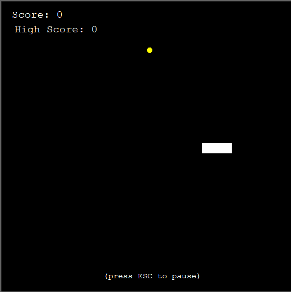
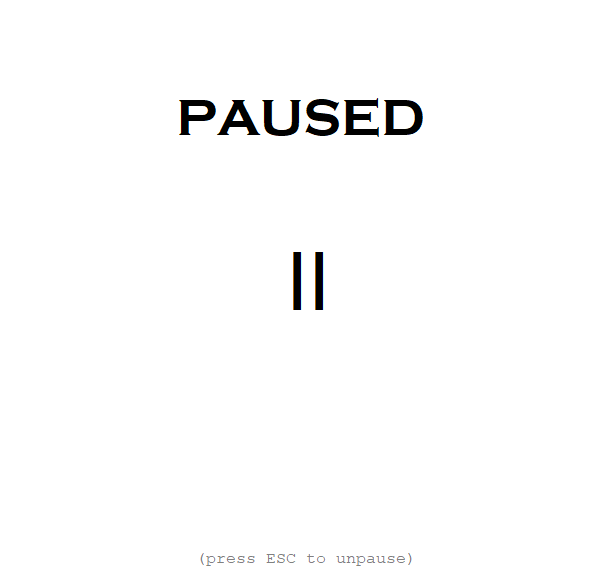

<!DOCTYPE HTML>
<html>
    <head>
        <meta charset="UTF-8">
    </head>
    <body>
        <h2>SNAKE GAME 🐍 </h2> 
        <em>Last update: January 12th, 2024</em>
        

            Fun and simple snake game built in Python! Features  highscores and pause screen.  
        

        Planning on:
        <ul>
            <li>Implementing different themes;</li>
            <li>Improving interface;</li>
            <li>Adding language changer.</li>
        </ul>
        

            Accepting any suggestions!
        

         
        
    </body>
</html>
